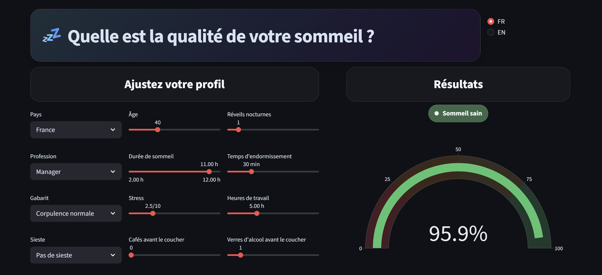

# 💤 Qualité de sommeil — Application Streamlit

Application interactive de prédiction de la qualité du sommeil, construite à partir d'un notebook de machine learning.


Lien de l'application : https://sleep-quality-vincent-schuler.streamlit.app/




Cette application permet de :
- modifier un profil utilisateur (inputs du modèle)
- obtenir instantanément une estimation de la qualité du sommeil
- comprendre les principaux facteurs qui influencent la prédiction


---

## Objectif

L'objectif du projet est double :
1. Proposer un template d'EDA et d'entrainement d'un modèle de ML (LightGBM)
2. Déployer une application avec Streamlit

---

## Fonctionnalités

- Interface Streamlit simple et intuitive à utiliser
- Prédiction instantanée à partir d'un modèle LightGBM sauvegardé en `.joblib`
- Explication de la prédiction avec SHAP
- Interface bilingue français / anglais

---

## Structure du projet

```bash
.
├── app.py
├── train.py
├── requirements.txt
├── README.md
├── images/
├── models/
│   ├── lgbm_full.joblib
│   ├── metadata.joblib
│   └── shap_explainer.joblib
└── src/
    ├── config.py
    ├── predict.py
    └── preprocess.py
```

---

## Lancer le projet en local

### 1. Cloner le dépôt

```bash
git clone https://github.com/votre-utilisateur/votre-repo.git
cd votre-repo
```

### 2. Créer un environnement virtuel

Sous Windows :
```bash
python -m venv .venv
.venv\Scripts\activate
```

Sous macOS / Linux :
```bash
python -m venv .venv
source .venv/bin/activate
```

### 3. Installer les dépendances

```bash
pip install -r requirements.txt
```

### 4. Vérifier les artefacts du modèle

L'application attend au minimum ce fichier :

```bash
models/lgbm_full.joblib
```

Optionnellement :

```bash
models/metadata.joblib
models/shap_explainer.joblib
```

### 5. Lancer l'application

```bash
streamlit run app.py
```

---

## Réentraîner le modèle

Si besoin, le modèle peut être ré-entrainé via le fichier train.py (ou via Notebook_EDA.ipynb) :

```bash
python train.py --data data/sleep_health_dataset.csv --export-dir models
```

Puis relancer l'application :

```bash
streamlit run app.py
```

---

## Déploiement sur Streamlit Community Cloud

1. pousser le code sur GitHub
2. se connecter à Streamlit Community Cloud
3. créer une nouvelle application
4. sélectionner le dépôt GitHub
5. choisir :
   - **Branch** : `main`
   - **Main file path** : `app.py`
6. déployer

À noter :
- `requirements.txt` doit être présent
- le dossier `models/` doit contenir les fichiers `.joblib`

---

## À propos du projet

Ce projet est une mise en production d'un pipeline de machine learning conçu initialement dans un notebook.  
J'ai voulu conserver la logique du modèle tout en transformant l'expérience en une application plus lisible, plus interactive et plus démonstrative.

C'est un projet orienté :
- machine learning appliqué
- productisation d'un notebook
- visualisation de prédictions
- portfolio data science / ML

---

## Auteur

**Vincent Schuler**  
